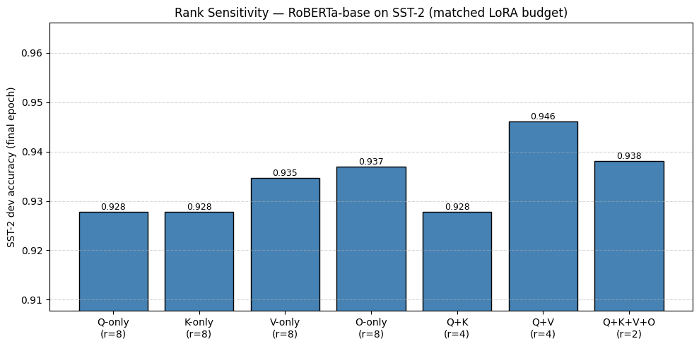

# CS5782 — LoRA Re-implementation

## 1. Introduction

- **What this repo is:** a **CS5782** course **re-implementation** of *LoRA: Low-Rank Adaptation of Large Language Models* (Hu et al., 2021)—we rerun a focused set of experiments to test the paper’s claims with limited compute.
- **What LoRA does:** **freezes** pretrained weights and trains small **low-rank adapters** in selected Transformer layers so task adaptation updates **far fewer parameters** than full fine-tuning while staying competitive on NLU/NLG.

## 2. Chosen result

- **Efficiency vs full FT:** check whether **LoRA** matches **full fine-tuning** at a **tiny trainable budget** (paper **Tables 2–3**, hyperparams **9–11**).
- **Rank / where to attach LoRA:** check whether **target-module choice** matters at **fixed parameter budget** (same spirit as **Table 5**, originally on **GPT-3**).

## 3. GitHub contents

- **Top-level docs:** `README.md` (this file); `CS5782 Final Report.md` (full report; can be large if figures are embedded).
- **`code/`** — notebooks + Colab-exported `.py`; each `.ipynb` / `.py` pair shares logic (notebooks are easiest for interactive runs).

| File | Description |
|------|-------------|
| `lora_efficiency_roberta_glue_sst2_mrpc.ipynb` / `.py` | RoBERTa-base on GLUE **SST-2** and **MRPC**: LoRA vs full fine-tuning (and related baselines in-notebook), accuracy-focused. |
| `lora_rank_sensitivity_roberta_glue.ipynb` / `.py` | RoBERTa on GLUE **SST-2**: sweep **LoRA rank** and **target modules** (Q / K / V / O and combinations) at comparable trainable-parameter budgets; produces sensitivity plots/metrics. |
| `lora_efficiency_gpt2_e2e.ipynb` / `.py` | **GPT-2 Medium** on the **E2E NLG** data-to-text task: LoRA vs full fine-tuning; **BLEU** vs references. |

- **`results/`** — saved runs (e.g. `rank_sensitivity_roberta.png`, `lora_efficiency_exp_results`); regenerate by re-running `code/`.
- **`data/`** — no checked-in corpora; see `data/README.md` for **GLUE** / **E2E** loading via Hugging Face `datasets`.
- **`poster/`** — course poster PDF (`Copy of lora_poster_mod.pdf`).

## 4. Re-implementation details

- **Models & tasks:** `roberta-base` on GLUE **SST-2** & **MRPC**; `gpt2-medium` on **E2E NLG**.
- **Metrics:** GLUE **accuracy**; E2E **BLEU** (via **sacrebleu**).
- **Stack:** PyTorch; Hugging Face `transformers`, `datasets`, `evaluate`, `accelerate`.
- **Compute vs paper:** they used **multi V100**; we used **one Colab A100** and ~**24–28h** total—narrower scope, same hyperparameter **tables** where we could (Table **9** and Table **11** from the LoRA paper).
- **Code shape:** `.py` files are **Colab exports** (may include `drive.mount`—strip for local; see **§5**).
- **Extra angle:** **encoder RoBERTa** rank sweep tests whether **Table 5**-style **Q+V** vs **Q+K+V+O** advice transfers from the paper’s **decoder** GPT-3 setup.

## 5. Reproduction steps

**Environment:** create a venv and install dependencies:

```bash
python -m venv .venv && source .venv/bin/activate
pip install torch transformers datasets evaluate accelerate tqdm numpy sacrebleu
```

**GPU:** CUDA strongly recommended (we used **1× A100**). **Run:** open `code/*.ipynb` or the matching `.py`; **comment out** `google.colab` / `drive.mount` for local use. **No CLI flags**—edit in-file hyperparameters (match paper **Table 9** / **Table 11**). Data: `load_dataset("glue", ...)` and E2E CSV URLs as in `data/README.md`.

## 6. Results / insights

**Compared to Hu et al. (2021)**

- **RoBERTa + LoRA (~0.3M trainable):** paper **Table 2** SST-2 **95.1±0.2**, MRPC **89.7±0.7**; ours **95.1** / **88.7** (report **Table 1**)—SST-2 on mean; MRPC a bit low vs their center.
- **GPT-2 Medium + LoRA (~0.35M) on E2E:** paper **Table 3** BLEU **70.4±0.1**; ours **65.88** (report **Table 2**)—LoRA trains, but we did not hit their absolute BLEU.
- **Rank / target modules (RoBERTa SST-2):** **Q+V** best, **Q+K+V+O** second (report **Figure 1**)—matches **Table 5**’s message that **Q+V** and **full-attention** LoRA are strong defaults.



**What you should expect from this repo.** After §5 you get **JSON/metric logs**, **RoBERTa GLUE** numbers close to the paper’s LoRA row on SST-2 (MRPC varies more by seed), **GPT-2 E2E** where LoRA trains but **BLEU often trails ~70.4** without extra runs/tuning, and a **rank/target sweep** (table + figure above). **Not** a bit-for-bit PDF match—especially E2E—**but** a runnable harness for the paper’s **qualitative** takeaways (efficient LoRA, Q+V / full-attention placements).

## 7. Conclusion

LoRA’s **parameter efficiency vs accuracy** story reproduced most cleanly on **GLUE**; **NLG** needed more runs/seeds to match published BLEU. **Lesson:** fixed paper hyperparameters carry classification well; generation may need extra tuning or averaging.

## 8. References

- Hu, Edward J., Yelong Shen, Phillip Wallis, Zeyuan Allen-Zhu, Yuanzhi Li, Shean Wang, Liang Wang, and Weizhu Chen. "LoRA: Low-rank adaptation of large language models." *ICLR* 1, no. 2 (2022): 3. (Preprint: https://arxiv.org/abs/2106.09685)
- Wang, Alex, Amanpreet Singh, Julian Michael, Felix Hill, Omer Levy, and Samuel Bowman. "GLUE: A multi-task benchmark and analysis platform for natural language understanding." In *Proceedings of the 2018 EMNLP Workshop BlackboxNLP: Analyzing and Interpreting Neural Networks for NLP*, pp. 353–355. 2018.
- Papineni, Kishore, Salim Roukos, Todd Ward, and Wei-Jing Zhu. "BLEU: a method for automatic evaluation of machine translation." In *Proceedings of the 40th Annual Meeting of the Association for Computational Linguistics*, pp. 311–318. 2002.
- Radford, Alec, Jeff Wu, Rewon Child, David Luan, Dario Amodei, and Ilya Sutskever. *Language Models are Unsupervised Multitask Learners.* OpenAI technical report, 2019.
- Liu, Yinhan, Myle Ott, Naman Goyal, Jingfei Du, Mandar Joshi, Danqi Chen, Omer Levy, Mike Lewis, Luke Zettlemoyer, and Veselin Stoyanov. "RoBERTa: A robustly optimized BERT pretraining approach." arXiv preprint arXiv:1907.11692 (2019).

**Implementation / data (not formal bibliography):** E2E NLG Challenge data (see `data/README.md`); Hugging Face libraries `transformers`, `datasets`, `evaluate`, `accelerate`.

## 9. Acknowledgements

Project for **CS5782** (graded coursework). **Group:** Lirong Yao, Laurence Yang, Haoyu Yan, Yaxi Zeng.
